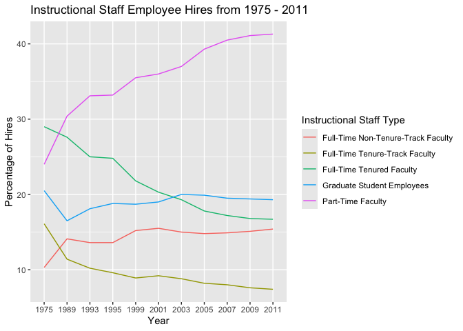
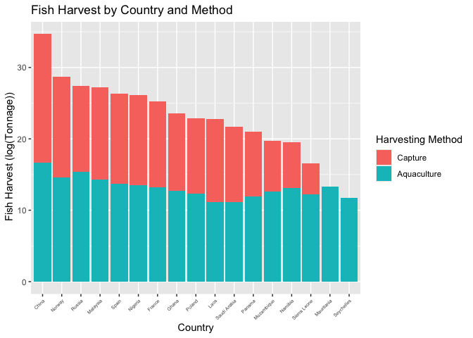
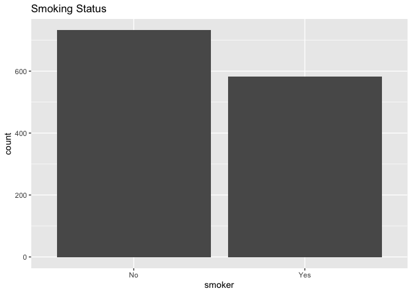
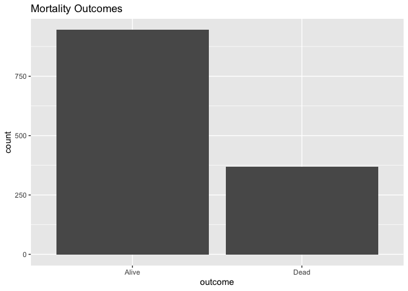
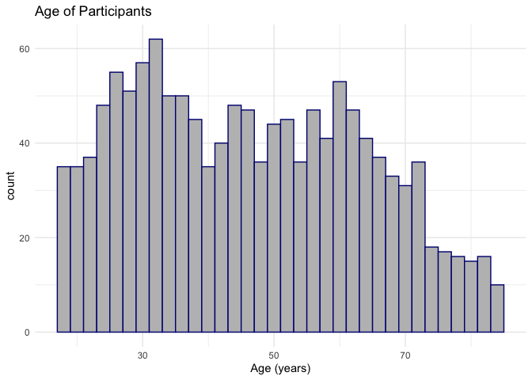
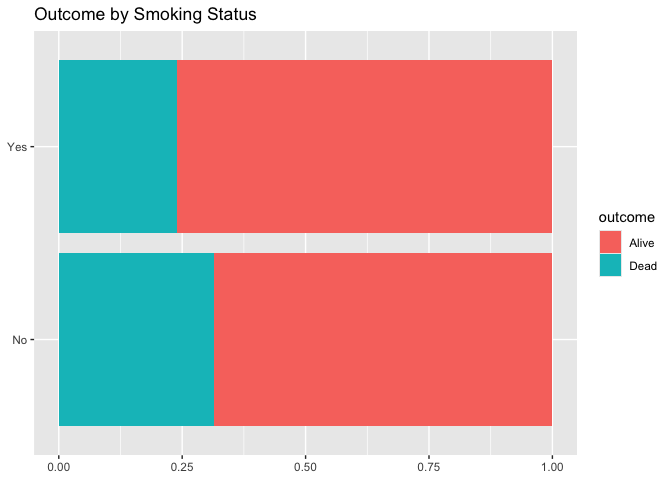
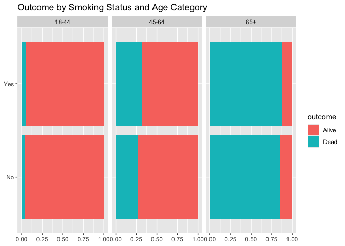

Lab 06 - Ugly charts and Simpson’s paradox
================
Lilly McClendon
03-02-2025

### Load packages and data

``` r
library(tidyverse) 
```

``` r
staff <- read_csv("data/instructional-staff.csv")
```

    ## Rows: 5 Columns: 12
    ## ── Column specification ────────────────────────────────────────────────────────
    ## Delimiter: ","
    ## chr  (1): faculty_type
    ## dbl (11): 1975, 1989, 1993, 1995, 1999, 2001, 2003, 2005, 2007, 2009, 2011
    ## 
    ## ℹ Use `spec()` to retrieve the full column specification for this data.
    ## ℹ Specify the column types or set `show_col_types = FALSE` to quiet this message.

``` r
view(staff)

# reshape the data 

staff_long <- staff %>%
  pivot_longer(cols = -faculty_type, names_to = "year") %>%
  mutate(value = as.numeric(value))

staff_long
```

    ## # A tibble: 55 × 3
    ##    faculty_type              year  value
    ##    <chr>                     <chr> <dbl>
    ##  1 Full-Time Tenured Faculty 1975   29  
    ##  2 Full-Time Tenured Faculty 1989   27.6
    ##  3 Full-Time Tenured Faculty 1993   25  
    ##  4 Full-Time Tenured Faculty 1995   24.8
    ##  5 Full-Time Tenured Faculty 1999   21.8
    ##  6 Full-Time Tenured Faculty 2001   20.3
    ##  7 Full-Time Tenured Faculty 2003   19.3
    ##  8 Full-Time Tenured Faculty 2005   17.8
    ##  9 Full-Time Tenured Faculty 2007   17.2
    ## 10 Full-Time Tenured Faculty 2009   16.8
    ## # ℹ 45 more rows

### Exercise 1

``` r
library(ggplot2)
staff_long %>%
  ggplot(aes(
    x = year,
    y = value,
    group = faculty_type,
    color = faculty_type
  )) + 
  labs(title = "Instructional Staff Employee Hires from 1975 - 2011", x = "Year", y = "Percentage of Hires") + 
  geom_line() + 
  guides(color = guide_legend(title = "Instructional Staff Type"))
```

<!-- -->

### Exercise 2

If the objective of this plot was to show that the proportion of part
time faculty have gone up over time compared to other instructional
staff types, I would use a stacked bar chart beccause it would allow for
the proportion of eachs staff type to be compared easily across the
years. A stacked bar chart would allow for both year and staff type to
be compared with proportion together. Year would be the total bar, and
the sub-bars would be the different staff types.

### Exercise 3

#### Improvement Ideas

I would plan to improve the plot by making it a bar plot so that it
would be easy to see the different subgroups of the data as the x axis
is country which is a categorical variable and the goal is to compare
different groups. Specifically, I would use a stacked bar chart as it
would allow for an easier comparison of the fish captured and fish
caught for each country and between countries. I will filter the data so
that same to the example, only countries with a total harvest of over
100,000 will be included and only the countries labelled in the
histogram will be included. I will change the y-axis to be logarithmic
because the data has a very large range of values and it will make the
data better able to be placed in a visual representation. The
logarithmic data results in the data appearing more even so that the
smaller harvest values (majority of the data) can still be seen .

#### Changes

- Mutated the dataset to add a column for the log value of capture and
  aquaculture.
- Changed plot to a stacked bar plot

``` r
library(dplyr)
library(ggplot2)

fisheries <- read_csv("data/fisheries.csv")
```

    ## Rows: 216 Columns: 4
    ## ── Column specification ────────────────────────────────────────────────────────
    ## Delimiter: ","
    ## chr (1): country
    ## dbl (3): capture, aquaculture, total
    ## 
    ## ℹ Use `spec()` to retrieve the full column specification for this data.
    ## ℹ Specify the column types or set `show_col_types = FALSE` to quiet this message.

``` r
fisheries_filtered <- fisheries %>% 
  filter(total >= 100000) %>%
  filter(country == "China" | country == "Russia" | country == "Norway" | country == "Malaysia" | country == "Spain" | country == "Nigeria" | country == "France" | country == "Mauritania" | country == "Namibia" | country == "Ghana" | country == "Mozambique" | country == "Poland" | country == "Sierra Leone" | country == "Laos" | country == "Panama"| country == "Seychelles" | country == "Saudi Arabia") %>% 
  mutate(log_capture = log(capture + 1)) %>% 
  mutate(log_aquaculture = log(aquaculture + 1))
print(fisheries_filtered)
```

    ## # A tibble: 17 × 6
    ##    country       capture aquaculture    total log_capture log_aquaculture
    ##    <chr>           <dbl>       <dbl>    <dbl>       <dbl>           <dbl>
    ##  1 China        17800000    63700000 81500000        16.7           18.0 
    ##  2 France         561173      166640   727813        13.2           12.0 
    ##  3 Ghana          327457       52480   379937        12.7           10.9 
    ##  4 Laos            70915      109835   180750        11.2           11.6 
    ##  5 Malaysia      1584371      407887  1992258        14.3           12.9 
    ##  6 Mauritania     609754           0   609754        13.3            0   
    ##  7 Mozambique     299591        1180   300771        12.6            7.07
    ##  8 Namibia        503878         591   504469        13.1            6.38
    ##  9 Nigeria        734731      306727  1041458        13.5           12.6 
    ## 10 Norway        2203360     1326216  3529576        14.6           14.1 
    ## 11 Panama         144450        8808   153258        11.9            9.08
    ## 12 Poland         218115       38300   256415        12.3           10.6 
    ## 13 Russia        4773413      173840  4947253        15.4           12.1 
    ## 14 Saudi Arabia    68082       39920   108002        11.1           10.6 
    ## 15 Seychelles     127128           0   127128        11.8            0   
    ## 16 Sierra Leone   202100          75   202175        12.2            4.33
    ## 17 Spain          915137      283831  1198968        13.7           12.6

``` r
fisheries_filtered_long <- fisheries_filtered %>% 
  pivot_longer(cols = starts_with("log_capture") | starts_with("log_aquaculture"), 
               names_to = "fishing_method", 
               values_to = "value")

ggplot(fisheries_filtered_long, aes(x =reorder(country, -value), y= value, fill = fishing_method)) + 
  geom_bar(stat="identity") + 
  labs(title = "Fish Harvest by Country and Method ", x = "Country", y = " Fish Harvest (log(Tonnage))") + 
  theme(axis.text.x = element_text(angle = 45, hjust = 1, size=5)) + 
  scale_fill_discrete(name = "Harvesting Method", labels = c("Capture", "Aquaculture"))
```

<!-- -->

## Stretch Practice

### Load packages and data

``` r
library(tidyverse) 
library(dsbox)
library(mosaicData) 
```

``` r
data(Whickham)

?Whickham

#library(performance)
#performance::compare_performance()
```

### Stretch Practice 1

I think these data came from an observational study because it is
described as surveying participants between 1972 and 1974 and then
following up 20 years later. Observational studies frequently involve
researchers monitoring participants over time. Unlike in an experimental
study, in this study, there was no manipulation of variables by the
researcher or a control group. Observational studies are commonly used
in public health or epidemiology research where the goal is to
understand a potential association between an exposure and outcome.
Further I think that this is an observational study because it would not
be ethical to manipulate smoking knowing the risks to see the potential
disease outcomes.

### Stretch Practice 2

``` r
view(Whickham)
nrow(Whickham)
```

    ## [1] 1314

``` r
ncol(Whickham)
```

    ## [1] 3

There are 1,314 observations in this data set. Each observation
represents a subset of the survey sample and included UK women who
either reported never smoked or currently smoked.

### Stretch Practice 3

There are 3 variables in the data set. Smoking (dichotomous,
categorical) and age (continuous) can be considered explanatory
variables and outcome can be considered a response variable
(dichotomous, categorical). In this study, smoking is observed to see if
there is an association with mortality.

``` r
library(ggplot2)
ggplot(Whickham, aes(x = smoker)) + 
  geom_bar() + 
  labs(title = "Smoking Status")
```

<!-- -->

``` r
library(ggplot2)
ggplot(Whickham, aes(x = outcome)) + 
  geom_bar() + 
  labs(title = "Mortality Outcomes")
```

<!-- -->

``` r
library(ggplot2)
ggplot(Whickham, aes(x=age)) + 
  geom_histogram(binwidth = 2, color = "navy", fill = "grey") + 
  labs(title = "Age of Participants", x = "Age (years)") + 
  theme_minimal()
```

<!-- -->

### Stretch Practice 4

I would expect the relationship between smoking status and health
outcome to be that more individuals who smoked have died.

### Stretch Practice 5

``` r
Whickham %>%
  count(smoker, outcome) %>%
  group_by(smoker) %>%
  mutate(prop_outcome = n / sum(n))
```

    ## # A tibble: 4 × 4
    ## # Groups:   smoker [2]
    ##   smoker outcome     n prop_outcome
    ##   <fct>  <fct>   <int>        <dbl>
    ## 1 No     Alive     502        0.686
    ## 2 No     Dead      230        0.314
    ## 3 Yes    Alive     443        0.761
    ## 4 Yes    Dead      139        0.239

``` r
ggplot(Whickham, aes(y = smoker, fill = outcome)) + 
  geom_bar(position = "fill") + 
  labs(title = "Outcome by Smoking Status", 
       y = NULL, x = NULL)
```

<!-- -->

The relationship between smoking status and health outcome did not meet
my expectation that individuals who smoked were more likely to have died
compared to individuals that did not smoke. The probability of being
alive was highst for individuals who smoked, and individuals who didn’t
smoke had a higher probability of being deceased.

### Stretch Practice 6

``` r
library(dplyr)
Whickham <- Whickham %>% 
  mutate(
    age_cat = dplyr::case_when(
      age <= 44 ~ "18-44", 
      age > 44 & age <= 64 ~ "45-64",
      age > 64 ~ "65+"
  )
)
```

### Stretch Practice 7

``` r
ggplot(Whickham, aes(y = smoker, fill = outcome)) + 
  geom_bar(position = "fill") + 
  facet_wrap(. ~ age_cat) +
  labs(title = "Outcome by Smoking Status and Age Category", 
       y = NULL, x = NULL)
```

<!-- -->

``` r
Whickham %>%
  count(smoker, age_cat, outcome) %>%
  group_by() %>%
  mutate(prop_outcome = n / sum(n))
```

    ## # A tibble: 12 × 5
    ##    smoker age_cat outcome     n prop_outcome
    ##    <fct>  <chr>   <fct>   <int>        <dbl>
    ##  1 No     18-44   Alive     327      0.249  
    ##  2 No     18-44   Dead       12      0.00913
    ##  3 No     45-64   Alive     147      0.112  
    ##  4 No     45-64   Dead       53      0.0403 
    ##  5 No     65+     Alive      28      0.0213 
    ##  6 No     65+     Dead      165      0.126  
    ##  7 Yes    18-44   Alive     270      0.205  
    ##  8 Yes    18-44   Dead       15      0.0114 
    ##  9 Yes    45-64   Alive     167      0.127  
    ## 10 Yes    45-64   Dead       80      0.0609 
    ## 11 Yes    65+     Alive       6      0.00457
    ## 12 Yes    65+     Dead       44      0.0335

When looking at the recreated visualization showing the relationship
between smoking status and health outcome faceted by age category, among
all groups, it appears that across all age groups when individuals
smoke, more of them are deceased. It appears to be particularly
pronounced in the 45-64 age range which may be as that is when diseases
from smoking may arise and lead to early mortality. It may be that when
you examine the 65+ category there is not as dramatic a difference in
mortality outcome between smokers and non-smokers as other health
problems tend to arise in older adults potentially leading to their
death.
